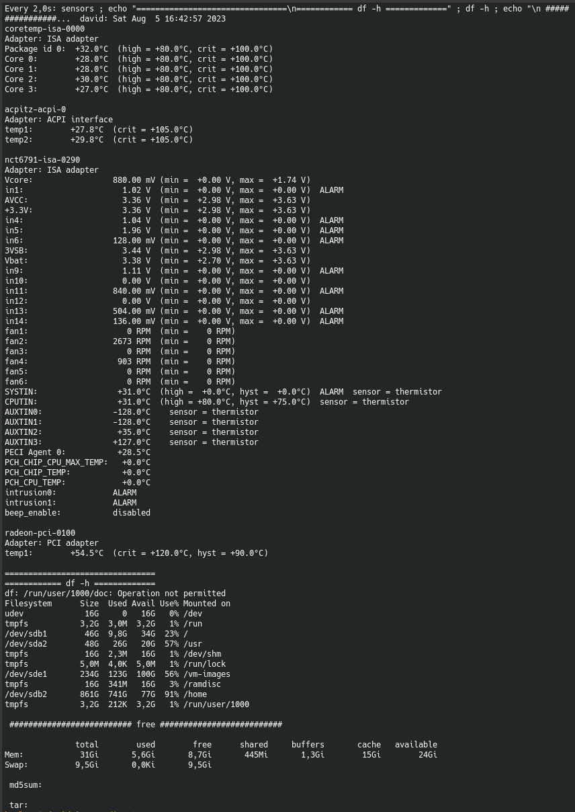

# :robot: Was macht es?

Es zeigt diverse Dinge alle 2 Sekunden auf einer Konsole an. 

# :mag: Wofür ist das gut?

*Wird bei mir unter anderem dafür verwendet:*

Wenn ein Backupprozess im Hintergrund läuft, ist es nicht einfach zu sehen, ob der Vorgang noch läuft oder nicht mehr.
Mittels der `watch`-Ausgabe wird angezeigt, ob aktuell ein `md5sum` oder `tar` Prozess läuft. Wenn eines von beiden da ist, arbeitet das Backup noch.

Zusätzlich werden die Sensordaten (nützlich um zu sehen, wie warm bzw. heiß das System läuft), der Platz der Partitionen und der RAM-Speicher angezeigt.

Das ist nur ein Beispiel. Je nachdem, wie viele Sensoren mit ausgegeben werden, wird evtl. nicht alles angezeigt. Dann sollte die Ausgabe von `sensors` nach ganz unten verlegt oder gänzlich entfernt werden.

Dies kann auch als Fernüberwachung genutzt werden. Mittels `ssh` auf den Server verbinden und als normaler Benutzer starten. 

Es gibt sicher sehr viele Programme für die Überwachung eines Backup- oder sonstigen Prozesses. Mir reicht das aber völlig.

# :eye: Wie nutzen?

- Datei speichern
- Einstellungen anpassen
- ausführbar machen
- starten `./watch_sensors_dfh.sh` (funktioniert auch als normaler Benutzer - keine Root-Rechte notwendig sind)
- beenden mittels `Strg` + `c` (`ctrl` + `c`)

# :hammer_and_wrench: Einstellungen

Schau dir `man watch` an. Dort gibt es noch einige Einstellungen mehr zur Ausgabenansicht.

# :point_right: Wichtiger Hinweis

k.A.

# :copyright: Der Originalhinweis

k.A.

# Beispielansicht

